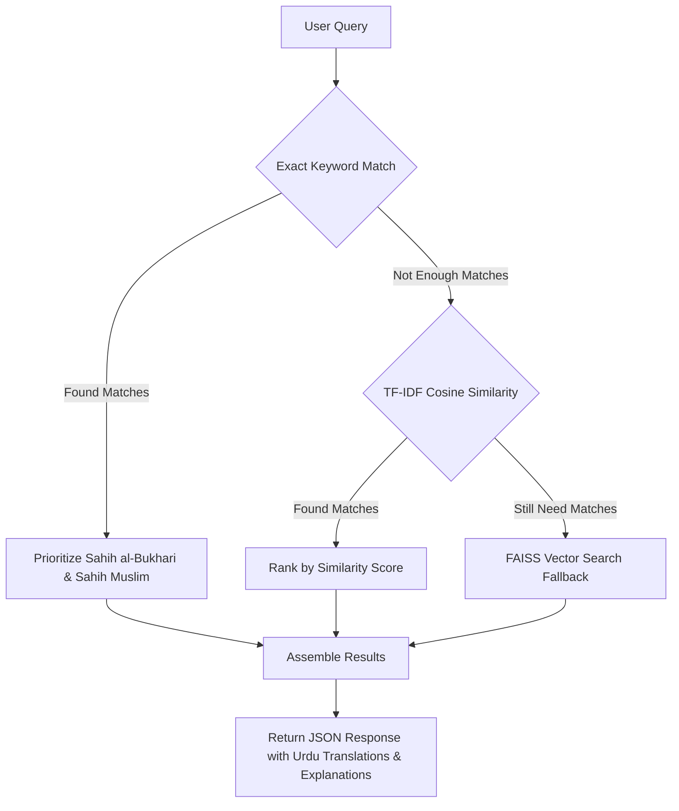

# Mishkat Al-Hadith: Implementation & Search Engine Walkthrough

Mishkat Al-Hadith is a high-performance RAG chatbot and parallel corpus explorer for the **Leeds-King Saud University (LK) Hadith Corpus** (containing 34,088 bilingual parallel hadith records).

---

## 1. System Architecture

The application has been upgraded with a **Hybrid Search Engine** that delivers highly relevant search results instantly:



### Search Tiers
1. **Tier 1: Case-Insensitive Keyword Match**: Searches for whole word matches in the English Hadith text, prioritizing primary collections like *Sahih al-Bukhari* and *Sahih Muslim*.
2. **Tier 2: TF-IDF Concept Search**: Fits a TF-IDF text search index using `scikit-learn` in less than a second at startup. Computes cosine similarities to retrieve matching concept hadiths (e.g., matching "fasting in hot summer" to hadiths about fasting on hot days).
3. **Tier 3: FAISS Semantic Fallback**: Fallback semantic vector matching.

---

## 2. API Specifications

### `POST /api/chat`
Performs a similarity search using the hybrid engine.

- **Request Body**:
  ```json
  {
    "message": "fasting in hot summer",
    "count": 3
  }
  ```
- **Response**:
  ```json
  {
    "query": "fasting in hot summer",
    "results": [
      {
        "id": 26047,
        "hadith_number": "2283",
        "book": "Sunan an-Nasa'i",
        "english_hadith": "We were with the Messenger of Allah on a journey...",
        "urdu_hadith": "ہم رسول اللہ صلی اللہ علیہ وسلم کے ساتھ ایک سفر میں تھے...",
        "explanation": { ... },
        "distance": 0.45
      }
    ]
  }
  ```

---

## 3. Execution Logs & Diagnostics
- **DLL Conflicts**: Bypassed duplicate Intel OpenMP runtime initializations by setting `KMP_DUPLICATE_LIB_OK=TRUE` at the top of the backend process.
- **Port Reuse**: Terminated orphaned processes bound to port `8000` to ensure the new hybrid search code runs cleanly.
